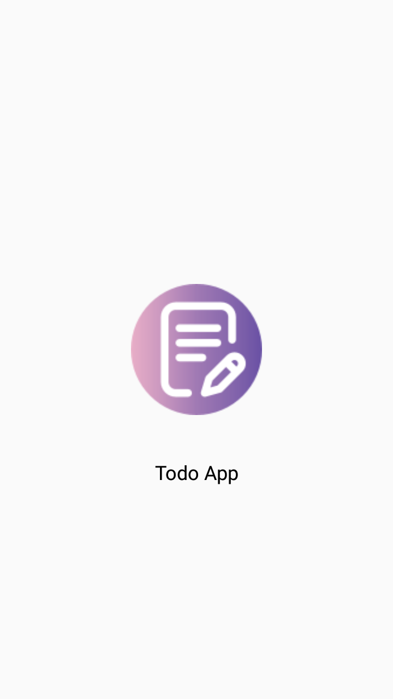
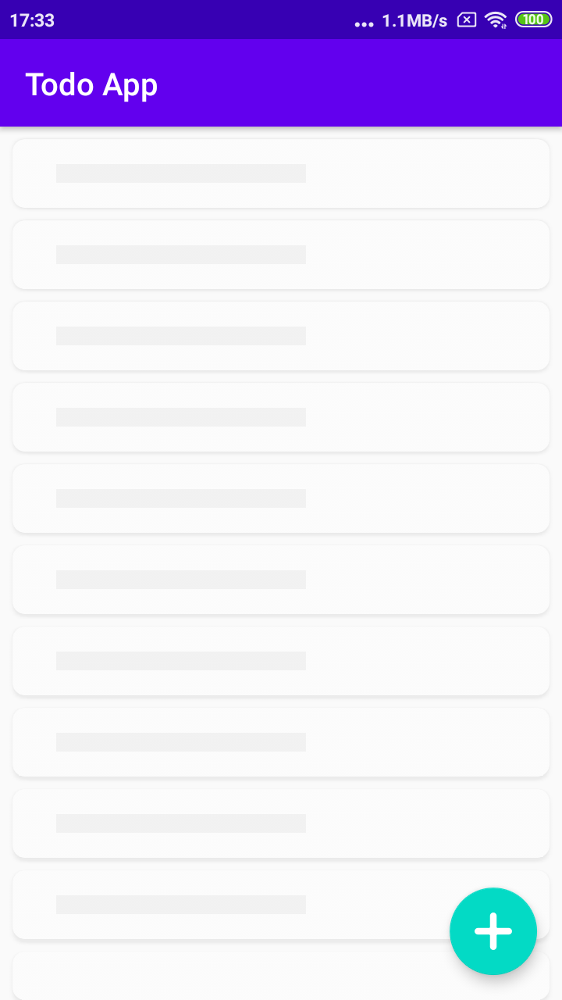
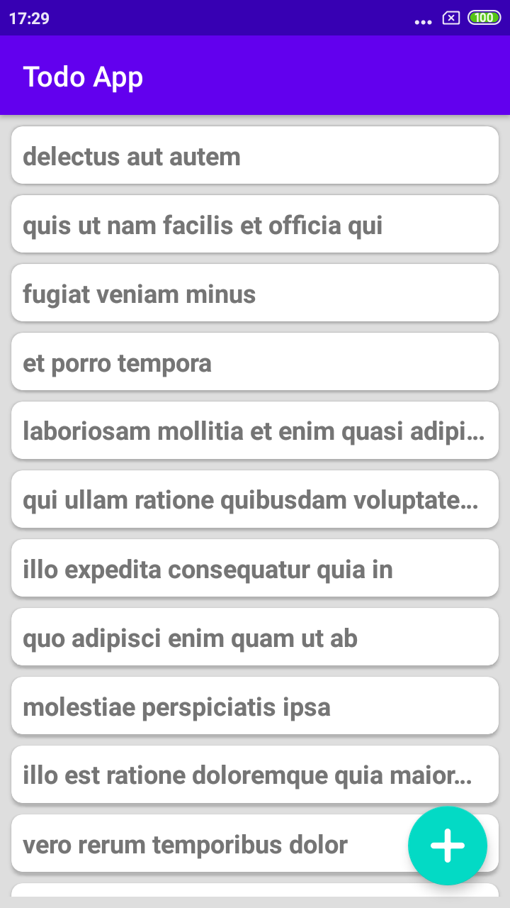
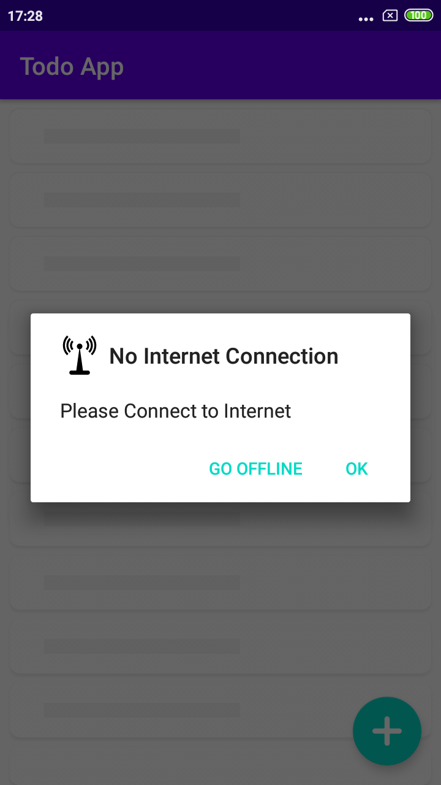
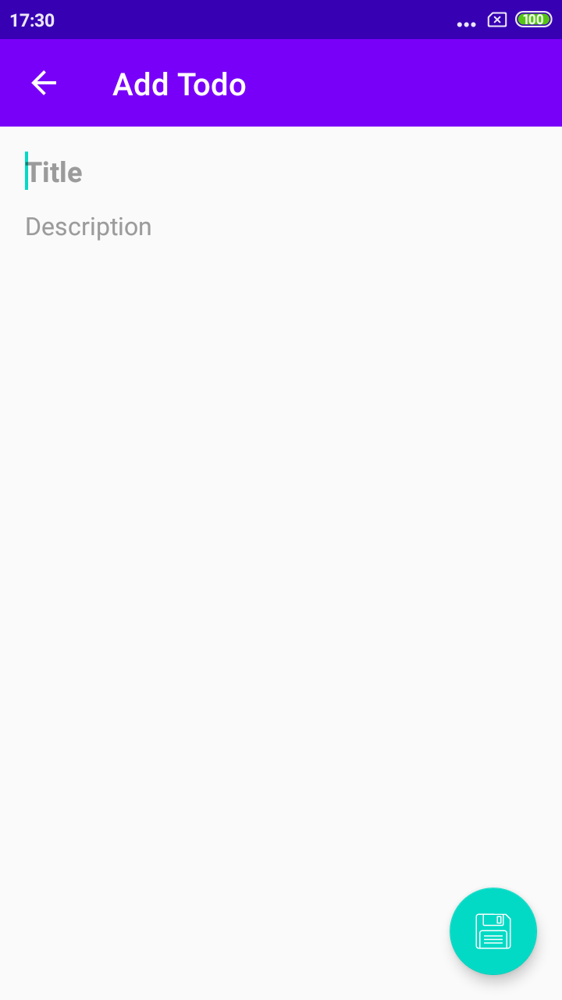
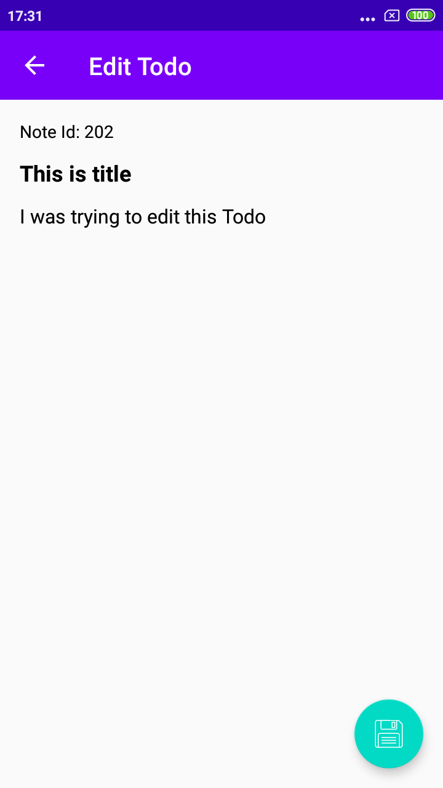

Todo App
----

### App Specifications:

- Room DB or [Room Persistence Library](https://developer.android.com/topic/libraries/architecture/room) used as local database of project
- [Androidx](https://developer.android.com/jetpack/androidx) and Material Design
- Kotlin 100% code
- Use of [Constraint Layout](https://developer.android.com/training/constraint-layout) in most layout, [Collapsing toolbar](https://material.io/develop/android/components/collapsing-toolbar-layout/).

- Support Android Version 4.2 and above.

### App Packages:

- *activity:* All activity of project.

- *adapter:* Main Activity adapter.

- *database:* Todo Local Database files

- *model:* All model class of project.

- *utils:* Files which can be used in entire project.

- [Release apk](APK/TodoApp.apk) for check/Try app.

Screenshot
----

<table>
  <tr>
    <td>
      
    </td>
    <td>
      
    </td>
    <td>
      
    </td>
  </tr>
</table>

<table>
  <tr>
    <td>
      
    </td>
    <td>
      
    </td>
    <td>
      
    </td>
  </tr>
</table>

